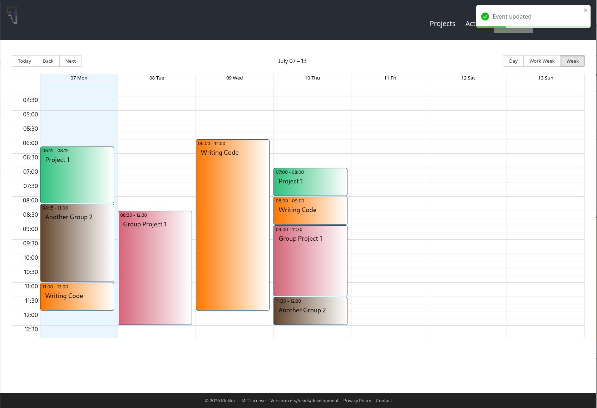

# Klukka
Klukka (Icelandic for clock) is a simple and easy to use Time Tracking service that allows you to track times spent an various projects in a browser.

## Screenshots

<table>
  <tr>
    <td></td>
    <td></td>
  </tr>
  <tr>
    <td></td>
    <td></td>
  </tr>
</table>

## Features
- Manage multiple projects with ease and track times to the second in your browser Mobile or Desktop. 
- Easily switch between projects. All your tracked times can be viewed and edited in a calendar.
- Gain insights into the times where you have spent the most time
- Export the Data as CSV
- Manage Groups to share Projects with multiple people to track times on the same Project
- Group admins can view and analyze the groups tracked times

## Docker
The most simple way is to run with docker-compose using the docker-compose.yaml file in the repository. Update the envirmoent variables with your own data and run docker compose up -d

## API
The API can be viewed via swagger or OpenAPI with /swagger or /open API per browser with the URL you have setup

License: MIT